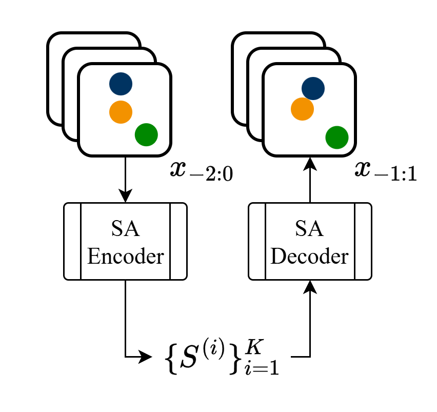

# SlotMachine (Object-centric frame stacking)
Learning causal representations from temporal sequences of images.

### Setup
Easiest way to set up the repository locally is via [uv](https://docs.astral.sh/uv/).
If not already installed, install uv following the [official instructions](https://docs.astral.sh/uv/getting-started/installation/).
Then, do the following steps:

1. Clone this repository.
2. Inside a terminal, navigate to the base folder of the cloned repository.
3. Set up the virtual environment via uv: If you are on a system with GPU devices run `uv sync --extra gpu`, otherwise `uv sync --extra cpu`.

To run any scripts inside the venv, run it via uv with `uv run script.py [SCRIPTARGUMENTS]`.

### Structure
- [train.py](train.py) contains training loop, losses, and optimizer setup
- [cfgs/](cfgs/) stores predefined configuration files for specific model setups
- [src/slotmachine/autoencoder.py](src/slotmachine/autoencoder.py) defines CNN encoder/decoder classes and positional grid embedding
- [src/slotmachine/disentanglement.py](src/slotmachine/disentanglement.py) defines disentanglement heads
- [src/slotmachine/match.py](src/slotmachine/match.py) contains matching and background filtering
- [src/slotmachine/mixing.py](src/slotmachine/mixing.py) defines Transformer building blocks for more advanced architectures
- [src/slotmachine/model.py](src/slotmachine/model.py) defines main model classes
- [src/slotmachine/slotattention.py](src/slotmachine/slotattention.py) provides slot attention class and logic
- [src/slotmachine/utils.py](src/slotmachine/utils.py) has helper functions related to configs, datasets, and metrics

### Configurations
Training hyperparameters and model structure are defined via configuration files.
For an example listing all possible options, see [cfgs/template.toml](cfgs/template.toml).
For specific architectures/training setups, see the [SlotAttention](cfgs/slot.toml), [Disentanglement](cfgs/dis.toml), [Mixer](cfgs/mixer.toml), or [SoftMixer](cfgs/soft.toml) configurations.
If you wish to modify the training setup, it is recommended to copy and modify one of the above.

Mixer and SoftMixer attempt to encourage better representations of latent velocity in the slots by mixing information across time, but both empirically perform worse than the plain SlotAttention architecture.

For disentanglement, `full` attempts to perform general matching across slot indices, while `direct` re-uses the slots from one sample as the initialization of the other. 
Generally, only the latter leads to succesful disentanglement.

### Training
To train a standard SlotAttention model for reconstruction on a Slipscape dataset run
```bash
uv run train.py slot.toml --name RUN_NAME --data PATH_TO_DATASET
```
The model checkpoints and training metrics will be written to `out/RUN_NAME/`. 
If the folder already exists from a previous run, a new folder with be created with an index appended, e.g. `out/RUN_NAME_0/`

To continue training the final checkpoint (e.g. epoch 250) with disentanglement enabled run
```bash
uv run train.py dis.toml --name RUN_NAME_DIS --data PATH_TO_DATSET --base RUN_NAME --base-epoch 250
```

With the provided configurations and a $80000$ sample dataset, reconstruction training takes roughly $30$ hours on a GPU machine, and disentanglement training another $16$ hours.

### Evaluation
Evaluation is defined in a separate config table from training, but runs through the same script.
If both tables are defined, the model is first trained then evaluated.
Otherwise only the operations of the defined table are run.
To use the existing evaluation config on a pre-trained model run
```bash
uv run train.py eval.toml --name EVAL_NAME --data PATH_TO_DATASET --base BASE_RUN_NAME
```

To evaluate MCC, the dataset must be generated with ground truth masks, and the model must have trained disentanglement heads.